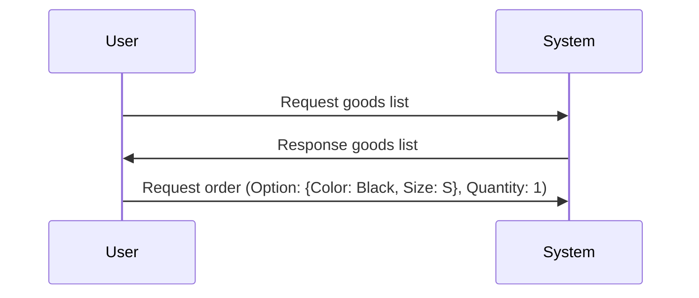
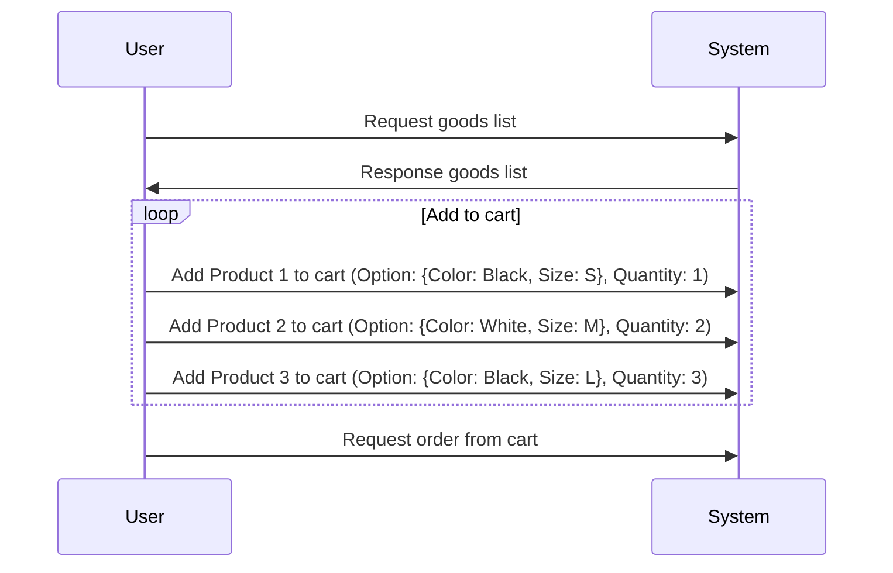
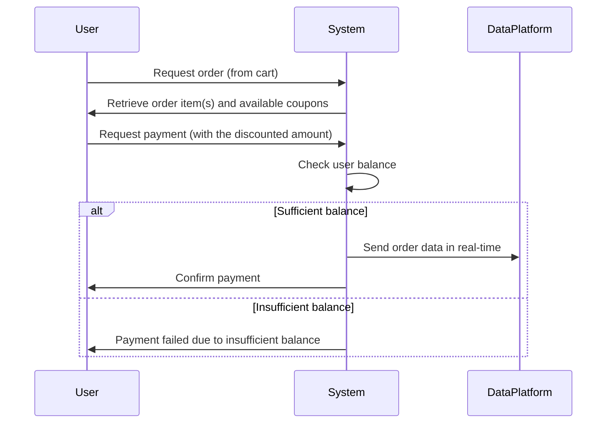

# E-Commerce

패션 브랜드 플랫폼을 위한 E-Commerce 서버를 개발하고자 합니다 🙂

----

## Business Requirements

- #### 상품 조회
  - 유저는 상품 목록(가격, 잔여수량 등)을 조회할 수 있습니다.
  - 유저는 랜딩 페이지에서 최근 3일 간 가장 많이 팔린 상위 5개 상품 정보를 조회할 수 있습니다.
- #### 결제 금액 충전 / 조회
  - 유저는 결제 시 사용될 금액을 충전할 수 있습니다. (충전 금액은 원화와 1:1 비율)
  - 최소 충전 금액은 1,000원 입니다.
  - 유저는 현재 잔액을 조회할 수 있습니다.
- #### 주문 / 결제
  - 유저는 즉시 주문 방식과 장바구니를 통한 주문 방식을 통해 주문 할 수 있습니다. 
  - 장바구니는 유저가 다른 기기에서 로그인하더라도 내용이 유지되어야 합니다. 
  - 결제는 충전된 잔액이 충분할 경우에만 가능하며, 결제 시 총 결제 금액만큼 잔액이 차감됩니다.
  - 데이터 분석을 목적으로 성공적으로 결제 이벤트가 발생할 경우 실시간으로 주문/결제 정보를 데이터 플랫폼에 전송해야 합니다.
- #### 쿠폰
  - 쿠폰은 고정 할인 방식과 비율 할인 방식 두 가지로 발급될 수 있습니다.
  - 유저는 선착순으로 한정된 수량의 할인 쿠폰을 최초 한 번만 발급받을 수 있습니다. 
  - 유저는 발급 받은 할인 쿠폰 목록을 조회할 수 있습니다.
  - 유저는 쿠폰은 발급 시점을 기준으로 일정 기간 내에 사용해야 하며, 유효기간이 지나면 사용할 수 없습니다.
  - 유저는 주문 결제 시 유효한 쿠폰을 통해 전체 주문금액에 대해 할인 혜택을 받을 수 있습니다.

----

## Use Cases

- #### 유저가 상품 목록 중 하나를 즉시 주문한다. 

- #### 유저가 여러 상품을 장바구니에 등록한 뒤, 한번에 모든 상품을 주문한다.

- #### 유저는 주문한 상품을 결제한다. (쿠폰 적용 포함) 

----

## Server Architecture

#### ① 다수의 웹 애플리케이션 서버 인스턴스

> 다수의 인스턴스로 어플리케이션이 동작하더라도 기능에 문제가 없도록 작성하도록 합니다.

- 위 기본 요구사항에 맞춰 다중화된 서버 인스턴스 환경을 전제로 진행합니다.  

#### ② 단일 데이터베이스 인스턴스

- 실시간 쿠폰 발급 등 데이터베이스에 부하가 커질 경우, 다중화된 데이터베이스 환경 또는 다른 방법을 시도해보려고 합니다. 첫 시작은 익숙한 단일 데이터베이스 환경으로 시작합니다.
- 웹 애플리케이션 서버가 수평적으로 확장된 구조이므로, 주요 기능에 필요한 동시성 제어는 기본적으로 데이터베이스 레이어에서 우선 처리해보려고 합니다.

#### ③ 캐시

- 최근 3일 간 가장 많이 팔린 상위 5개 상품 정보 조회 등 통계 기반으로 조회하는 기능을 처리할 때 캐시를 활용하면 보다 효율적으로 처리 가능할 것으로 기대되어 추가했습니다. 
- 최근 3일 간 가장 많이 팔린 상위 5개 상품 조회의 경우, 일정 주기로 발생한 이벤트를 취합한 결과를 조회하는 과정이므로 특히 캐시 사용이 적절하다고 판단했습니다.

#### ④ 메시지 큐

- 데이터 분석을 목적으로 성공적으로 결제 이벤트가 발생할 경우 실시간으로 주문/결제 정보를 데이터 플랫폼에 전송하기 위해서 Message Queue, REST API 등 적절한 기술을 선택 하여 활용할 예정입니다.

----

## Milestone

- 총 3주 간의 일정을 기준으로 Milestone을 작성했습니다.
- 1MD = 평균 5~6시간을 사용할 수 있습니다. 
- 선착순 쿠폰 발급 시스템, 실시간 데이터 스트림 등에서 사용될 수 있는 기술들을 사용해본 경험이 없어서 2주차 남은 시간과, 3주차는 해당 기술에 대한 학습과 구현에 초점을 맞췄습니다.