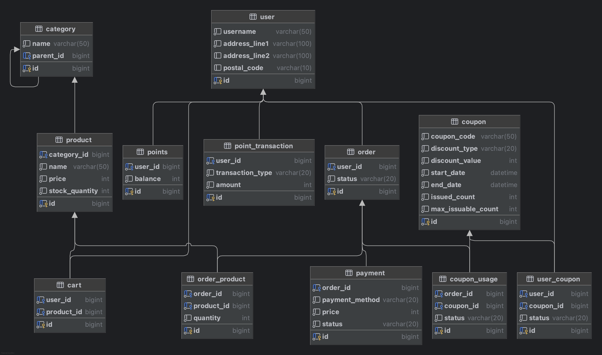

# E-Commerce

패션 브랜드 플랫폼을 위한 E-Commerce 서버를 개발하고자 합니다 🙂

----

## Business Requirements

- #### 상품 조회
  - 유저는 상품 목록(가격, 잔여수량 등)을 조회할 수 있습니다.
  - 유저는 랜딩 페이지에서 최근 3일 간 가장 많이 팔린 상위 5개 상품 정보를 조회할 수 있습니다.
- #### 결제 금액 충전 / 조회
  - 유저는 결제 시 사용될 금액을 충전할 수 있습니다. (충전 금액은 원화와 1:1 비율)
  - 최소 충전 금액은 1,000원 입니다.
  - 유저는 현재 잔액을 조회할 수 있습니다.
- #### 주문 / 결제
  - 유저는 **즉시 주문 방식**과 **장바구니를 통한 주문 방식**을 통해 주문할 수 있습니다. 
  - 장바구니는 유저가 다른 기기에서 로그인하더라도 내용이 유지되어야 합니다. 
  - 주문은 기본적으로 **결제 대기 상태**로 저장되며, 결제 여부에 따라 주문 상태가 업데이트됩니다.
  - 주문 시점의 재고 확인
    - 주문 단계 시점에 재고 여부를 확인하지만, 재고를 확보하지는 않습니다. 
    - 주문 후, 결제 시점에서 상품 재고를 다시 확인 하며, 재고가 부족할 경우 결제는 실패 처리됩니다.
  - 장바구니에 있던 상품이 결제 완료된 경우, 해당 상품을 장바구니에서 자동으로 제거합니다.   
  - 충전된 잔액이 충분할 경우에만 결제 가능하며, 결제 시 총 결제 금액만큼 잔액이 차감됩니다.
  - 데이터 분석을 목적으로 성공적으로 결제 이벤트가 발생할 경우 실시간으로 주문/결제 정보를 데이터 플랫폼에 전송해야 합니다.
- #### 쿠폰
  - 쿠폰은 고정 할인 방식과 비율 할인 방식 두 가지로 발급될 수 있습니다.
  - 유저는 선착순으로 한정된 수량의 할인 쿠폰을 최초 한 번만 발급 받을 수 있습니다. 
  - 유저는 발급 받은 할인 쿠폰 목록을 조회할 수 있습니다.
  - 유저는 쿠폰은 발급 시점을 기준으로 일정 기간 내에 사용해야 하며, 유효기간이 지나면 사용할 수 없습니다.
  - 유저는 주문 결제 시 유효한 쿠폰을 통해 전체 주문 금액에 대해 할인 혜택을 받을 수 있습니다.

----

## Server Architecture

#### ① 다수의 웹 애플리케이션 서버 인스턴스

> 다수의 인스턴스로 어플리케이션이 동작하더라도 기능에 문제가 없도록 작성하도록 합니다.

- 위 기본 요구사항에 맞춰 다중화된 서버 인스턴스 환경을 전제로 진행합니다.

#### ② 단일 데이터베이스 인스턴스

- 이번 주차 주요 비즈니스 로직 구현(상품 재고, 결제, 선착순 쿠폰 발급 등)에 필요한 **동시성 제어는 데이터베이스 차원에서 처리**했습니다.

#### ③ 메시지 큐

> 데이터 분석을 목적으로 성공적으로 결제 이벤트가 발생할 경우 실시간으로 주문/결제 정보를 데이터 플랫폼에 전송해야 합니다.

- 이번 주차 구현에서는 데이터 플랫폼이 애플리케이션 외부에 있다는 점을 전제로 하여, 상세 구현은 제외하고 플랫폼 호출 부분만 구현했습니다.

----

## Use Cases

- #### 유저는 상품을 주문한다.

- #### 유저는 주문 상품을 결제한다.

- #### 유저는 제한된 수량의 쿠폰 발급을 요청한다.

----

## Milestone

- 총 3주 간의 일정을 기준으로 Milestone을 작성했습니다.
- 1MD = 평균 5~6시간을 사용할 수 있습니다. 
- 선착순 쿠폰 발급 시스템, 실시간 데이터 스트림 등에서 사용될 수 있는 기술들을 사용해본 경험이 없어서 2주차 남은 시간과, 3주차는 해당 기술에 대한 학습과 구현에 초점을 맞췄습니다.

----

## ERD

----

## API Specification via Swagger

애플리케이션 구동 후 아래 주소에서 Swagger UI를 통해 API 명세를 확인할 수 있습니다. 

### 🔗 **Swagger UI Link**
[👉 http://localhost:8080/swagger-ui/index.html](http://localhost:8080/swagger-ui/index.html)
