# E-Commerce

패션 브랜드 플랫폼을 위한 E-Commerce 서버를 개발하고자 합니다 🙂

[STEP11] 과제 링크: https://stealth-metal-dd1.notion.site/STEP11-1838778b3259805b948eeeaa0b4f564b?pvs=4

----

## Business Requirements

- #### 상품 조회
  - 유저는 상품 목록(가격, 잔여수량 등)을 조회할 수 있습니다.
  - 유저는 랜딩 페이지에서 최근 3일 간 가장 많이 팔린 상위 5개 상품 정보를 조회할 수 있습니다.
- #### 결제 금액 충전 / 조회
  - 유저는 결제 시 사용될 금액을 충전할 수 있습니다. (충전 금액은 원화와 1:1 비율)
  - 최소 충전 금액은 1,000원 입니다.
  - 유저는 현재 잔액을 조회할 수 있습니다.
- #### 주문 / 결제
  - 유저는 **즉시 주문 방식**과 **장바구니를 통한 주문 방식**을 통해 주문할 수 있습니다. 
  - 장바구니는 유저가 다른 기기에서 로그인하더라도 내용이 유지되어야 합니다. 
  - 주문은 기본적으로 **결제 대기 상태**로 저장되며, 결제 여부에 따라 주문 상태가 업데이트됩니다.
  - 주문 시점의 재고 확인
    - 주문 단계 시점에 재고 여부를 확인하지만, 재고를 확보하지는 않습니다. 
    - 주문 후, 결제 시점에서 상품 재고를 다시 확인 하며, 재고가 부족할 경우 결제는 실패 처리됩니다.
  - 장바구니에 있던 상품이 결제 완료된 경우, 해당 상품을 장바구니에서 자동으로 제거합니다.   
  - 충전된 잔액이 충분할 경우에만 결제 가능하며, 결제 시 총 결제 금액만큼 잔액이 차감됩니다.
  - 데이터 분석을 목적으로 성공적으로 결제 이벤트가 발생할 경우 실시간으로 주문/결제 정보를 데이터 플랫폼에 전송해야 합니다.
- #### 쿠폰
  - 쿠폰은 고정 할인 방식과 비율 할인 방식 두 가지로 발급될 수 있습니다.
  - 유저는 선착순으로 한정된 수량의 할인 쿠폰을 최초 한 번만 발급 받을 수 있습니다. 
  - 유저는 발급 받은 할인 쿠폰 목록을 조회할 수 있습니다.
  - 유저는 쿠폰은 발급 시점을 기준으로 일정 기간 내에 사용해야 하며, 유효기간이 지나면 사용할 수 없습니다.
  - 유저는 주문 결제 시 유효한 쿠폰을 통해 전체 주문 금액에 대해 할인 혜택을 받을 수 있습니다.

----

## Server Architecture

#### ① 다수의 웹 애플리케이션 서버 인스턴스

> 다수의 인스턴스로 어플리케이션이 동작하더라도 기능에 문제가 없도록 작성하도록 합니다.

- 위 기본 요구사항에 맞춰 다중화된 서버 인스턴스 환경을 전제로 진행합니다.

#### ② 단일 데이터베이스 인스턴스

- 이번 주차 주요 비즈니스 로직 구현(상품 재고, 결제, 선착순 쿠폰 발급 등)에 필요한 **동시성 제어는 데이터베이스 차원에서 처리**했습니다.

#### ③ 메시지 큐

> 데이터 분석을 목적으로 성공적으로 결제 이벤트가 발생할 경우 실시간으로 주문/결제 정보를 데이터 플랫폼에 전송해야 합니다.

- 이번 주차 구현에서는 데이터 플랫폼이 애플리케이션 외부에 있다는 점을 전제로 하여, 상세 구현은 제외하고 플랫폼 호출 부분만 구현했습니다.

----

## Use Cases

- #### 유저는 상품을 주문한다.

- #### 유저는 주문 상품을 결제한다.

```mermaid
sequenceDiagram
    autonumber

    participant User as User
    participant API as API Gateway
    participant PaymentFacade as Payment Facade
    participant ProductService as Product Service
    participant StockService as Stock Service
    participant PaymentService as Payment Service
    participant OrderService as Order Service
    participant CartService as Cart Service

%% 1. Payment Request
    User ->>+ API: POST /orders/payments
    API ->>+ PaymentFacade: Payment Request

%% 2. Validate Products via Facade
    PaymentFacade ->>+ ProductService: Validate All Products
    alt Product Validation Failure
        ProductService --x PaymentFacade: ProductNotFoundException
        API -->> User: Exception Response
    else Product Validation Success
        ProductService -->>- PaymentFacade: All Products Validated
    end

%% 3. Check Stock via Facade
    PaymentFacade ->>+ StockService: [LOCK 🔒] Check Stock for All Products 
    alt Insufficient Stock
        StockService --x PaymentFacade: ProductOutOfStockException
        API -->> User: Exception Response
    else Sufficient Stock
        StockService -->>- PaymentFacade: Stock Checked for All Products
    end

%% 4. User Payment Balance Check via Facade
    PaymentFacade ->>+ PaymentService: [LOCK 🔒] Check User Balance 
    PaymentService -->>- PaymentFacade: User Balance Information

    alt Insufficient Balance
        PaymentService -->> PaymentFacade: InsufficientBalanceException
        API -->> User: Exception Response
    else Sufficient Balance
    %% 5. Payment Processing via Facade

    %% 5.1 Deduct Balance
        PaymentFacade ->>+ PaymentService: Deduct Balance
        PaymentService -->>- PaymentFacade: Balance Deducted

    %% 5.2 Deduct Stock
        PaymentFacade ->>+ StockService: Deduct Stock 
        StockService -->>- PaymentFacade: Stock Deducted

    %% 5.3 Save Order Data via Order Service
        PaymentFacade ->>+ OrderService: Save Order Data
        OrderService -->>- PaymentFacade: Order Data Saved
    
    %% 5.4 Remove Ordered Products from Cart
        PaymentFacade ->>+ CartService: Remove Ordered Products from Cart If Exists
        CartService -->>- PaymentFacade: Products Removed from Cart

    %% 6. Send Data to Data Platform (Async)
        PaymentFacade ->>+ DataPlatform: [ASYNC] Produce Order Data When Payment Confirmed 
        DataPlatform -->>- PaymentFacade: Ack (Order Data Received) 

    %% 7. Payment Success Response
        PaymentFacade -->> API: Payment Confirmed
        API -->> User: Payment Success Response
    end
```

- #### 유저는 제한된 수량의 쿠폰 발급을 요청한다.

```mermaid
sequenceDiagram
    autonumber

    participant User as User
    participant API as API Gateway
    participant CouponService as Coupon Service

%% 1. 쿠폰 발급 요청
    User ->>+ API: POST /coupons/issues
    API ->>+ CouponService: Issue Coupon

%% 2. 유효성 검사 (중복 여부 확인)
    CouponService ->>+ CouponService: Check if user already has coupon
    alt User Already Has Coupon
        CouponService --x CouponService: CouponAlreadyIssuedException
        API -->> User: Exception Response 
    end

%% 3. 쿠폰 재고 확인 및 감소
    CouponService ->>+ CouponService: [LOCK 🔒] Check Coupon Stock
    alt No Available Stock
        CouponService --x CouponService: CouponOutOfStockException
        API -->> User: Exception Response
    end

%% 4. 유저-쿠폰 관계 저장
    CouponService ->>+ CouponService: Save User-Coupon Relation

%% 5. 응답 반환
    CouponService -->> API: Coupon Issued
    API -->> User: Success Response
```

----

## Milestone

- 총 3주 간의 일정을 기준으로 Milestone을 작성했습니다.
- 1MD = 평균 5~6시간을 사용할 수 있습니다. 
- 선착순 쿠폰 발급 시스템, 실시간 데이터 스트림 등에서 사용될 수 있는 기술들을 사용해본 경험이 없어서 2주차 남은 시간과, 3주차는 해당 기술에 대한 학습과 구현에 초점을 맞췄습니다.

----

## ERD

----

## API Specification via Swagger

#### FYI. 이번 주차에 API 까지 완성이 되지 않아 `Try it`은 동작하지 않습니다! 서버 구동 후 [Link](http://localhost:8080/swagger-ui/index.html) 에서도 확인 가능합니다 :-)  

Point API

Product API

Coupon API

Order API

Payment API

