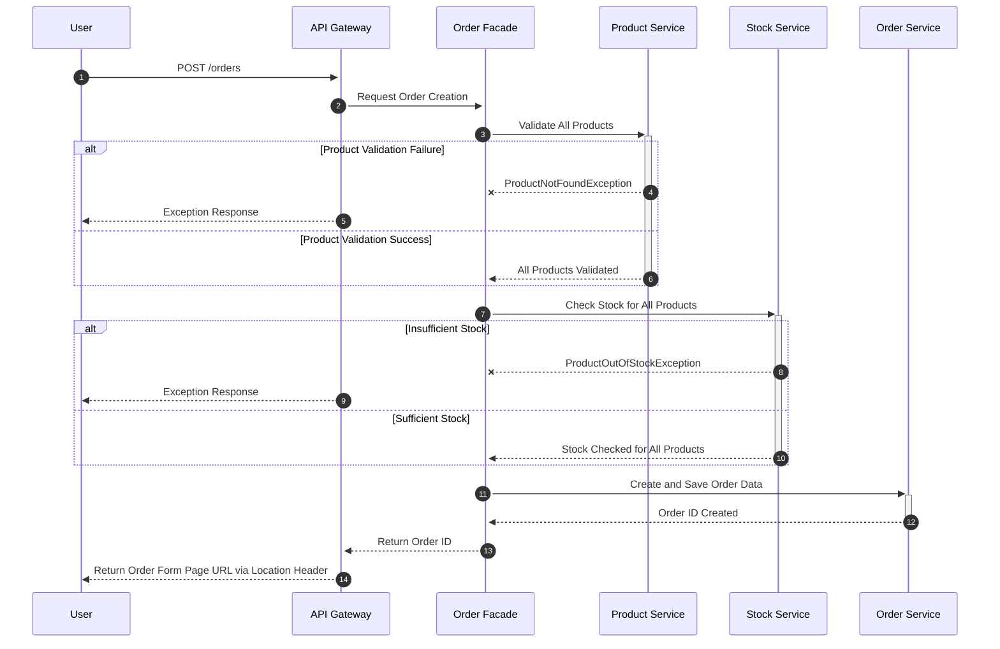
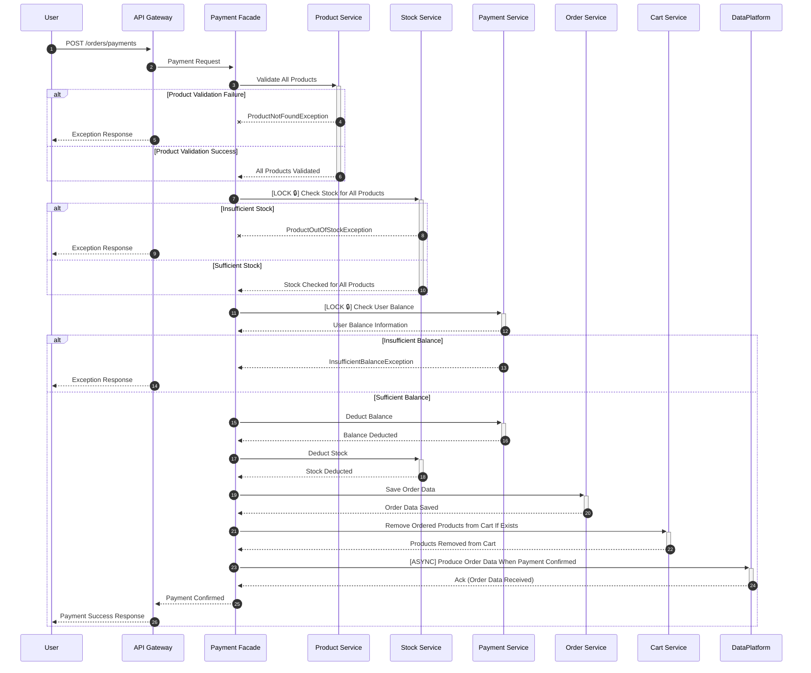
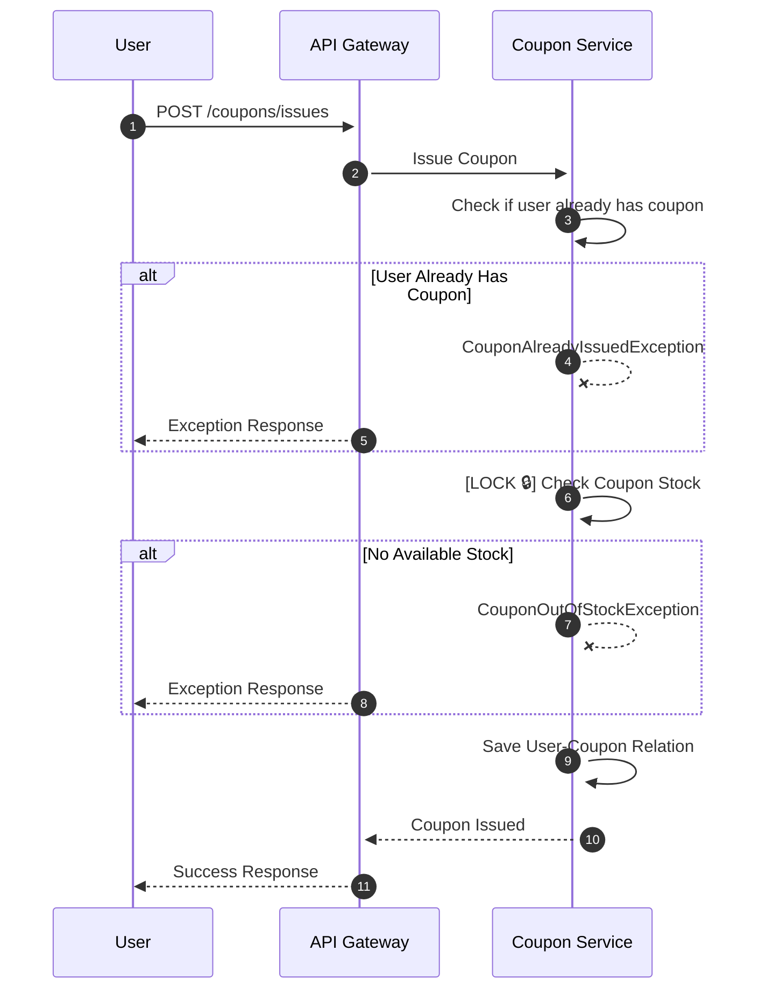

## Use Cases

- #### 유저는 상품을 주문한다.

```mermaid
sequenceDiagram
    autonumber

    participant User as User
    participant API as API Gateway
    participant OrderFacade as Order Facade
    participant ProductService as Product Service
    participant StockService as Stock Service
    participant OrderService as Order Service

%% 1. Order Creation Request
    User ->>+ API: POST /orders
    API ->>+ OrderFacade: Request Order Creation

%% 2. Product Validity Check
    OrderFacade ->>+ ProductService: Validate All Products
    alt Product Validation Failure
        ProductService --x OrderFacade: ProductNotFoundException
        API -->> User: Exception Response
    else Product Validation Success
        ProductService -->>- OrderFacade: All Products Validated
    end

%% 3. Stock Check
    OrderFacade ->>+ StockService: Check Stock for All Products
    alt Insufficient Stock
        StockService --x OrderFacade: ProductOutOfStockException
        API -->> User: Exception Response
    else Sufficient Stock
        StockService -->>- OrderFacade: Stock Checked for All Products
    end

%% 4. Order Data Creation
    OrderFacade ->>+ OrderService: Create and Save Order Data 
    OrderService -->>- OrderFacade: Order ID Created

%% 5. User Response
    OrderFacade -->> API: Return Order ID
    API -->> User: Return Order Form Page URL via Location Header
```

- #### 유저는 주문 상품을 결제한다.

```mermaid
sequenceDiagram
    autonumber

    participant User as User
    participant API as API Gateway
    participant PaymentFacade as Payment Facade
    participant ProductService as Product Service
    participant StockService as Stock Service
    participant PaymentService as Payment Service
    participant OrderService as Order Service
    participant CartService as Cart Service

%% 1. Payment Request
    User ->>+ API: POST /orders/payments
    API ->>+ PaymentFacade: Payment Request

%% 2. Validate Products via Facade
    PaymentFacade ->>+ ProductService: Validate All Products
    alt Product Validation Failure
        ProductService --x PaymentFacade: ProductNotFoundException
        API -->> User: Exception Response
    else Product Validation Success
        ProductService -->>- PaymentFacade: All Products Validated
    end

%% 3. Check Stock via Facade
    PaymentFacade ->>+ StockService: [LOCK 🔒] Check Stock for All Products 
    alt Insufficient Stock
        StockService --x PaymentFacade: ProductOutOfStockException
        API -->> User: Exception Response
    else Sufficient Stock
        StockService -->>- PaymentFacade: Stock Checked for All Products
    end

%% 4. User Payment Balance Check via Facade
    PaymentFacade ->>+ PaymentService: [LOCK 🔒] Check User Balance 
    PaymentService -->>- PaymentFacade: User Balance Information

    alt Insufficient Balance
        PaymentService -->> PaymentFacade: InsufficientBalanceException
        API -->> User: Exception Response
    else Sufficient Balance
    %% 5. Payment Processing via Facade

    %% 5.1 Deduct Balance
        PaymentFacade ->>+ PaymentService: Deduct Balance
        PaymentService -->>- PaymentFacade: Balance Deducted

    %% 5.2 Deduct Stock
        PaymentFacade ->>+ StockService: Deduct Stock 
        StockService -->>- PaymentFacade: Stock Deducted

    %% 5.3 Save Order Data via Order Service
        PaymentFacade ->>+ OrderService: Save Order Data
        OrderService -->>- PaymentFacade: Order Data Saved
    
    %% 5.4 Remove Ordered Products from Cart
        PaymentFacade ->>+ CartService: Remove Ordered Products from Cart If Exists
        CartService -->>- PaymentFacade: Products Removed from Cart

    %% 6. Send Data to Data Platform (Async)
        PaymentFacade ->>+ DataPlatform: [ASYNC] Produce Order Data When Payment Confirmed 
        DataPlatform -->>- PaymentFacade: Ack (Order Data Received) 

    %% 7. Payment Success Response
        PaymentFacade -->> API: Payment Confirmed
        API -->> User: Payment Success Response
    end
```

- #### 유저는 제한된 수량의 쿠폰 발급을 요청한다.

```mermaid
sequenceDiagram
    autonumber

    participant User as User
    participant API as API Gateway
    participant CouponService as Coupon Service

%% 1. 쿠폰 발급 요청
    User ->>+ API: POST /coupons/issues
    API ->>+ CouponService: Issue Coupon

%% 2. 유효성 검사 (중복 여부 확인)
    CouponService ->>+ CouponService: Check if user already has coupon
    alt User Already Has Coupon
        CouponService --x CouponService: CouponAlreadyIssuedException
        API -->> User: Exception Response 
    end

%% 3. 쿠폰 재고 확인 및 감소
    CouponService ->>+ CouponService: [LOCK 🔒] Check Coupon Stock
    alt No Available Stock
        CouponService --x CouponService: CouponOutOfStockException
        API -->> User: Exception Response
    end

%% 4. 유저-쿠폰 관계 저장
    CouponService ->>+ CouponService: Save User-Coupon Relation

%% 5. 응답 반환
    CouponService -->> API: Coupon Issued
    API -->> User: Success Response
```